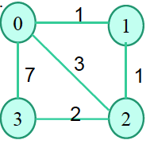

## Project 3

Project 3 is an implementation of a distributed asynchronous distance vector
routing protocol in C. For the assignment I was provided with a network emulator
and wrote the functions for each node to implement a distance vector routing
algorithm to find shortest paths to all other nodes.

The implementation works for any number of nodes (up to MAX_NODES = 10) in any
configuration. The default configuration is shown below, but this can be changed
in the "NodeConfigurationFile".

To compile the project on GNU/Linux systems, use the `make` command. Then run it
with `./project3`. The program will prompt for a trace level. Higher trace
levels print more debugging information, while a trace level of 1 will only
print the essential information.

Each node initializes a table of shortest routes when the program begins, then
sends its information to each of its directly connected neighbors. When a node
receives a routing packet it updates its own information if it can find a new
shortest path with the new information, then send its updated information to
each of its immediate neighbors again. After some time the entire network should
know the shortest paths between any two hosts.

This assignment required duplicating essentially exactly the same code for each
node's source file. This made testing very tedious, so I wrote a script
(`update.sh`) that copies `node0.c` to each of the other node source files and
replaces any specific function or variable names with the other node's
equivalent. This is a bad way to write code, but it was required for the
assignment.
